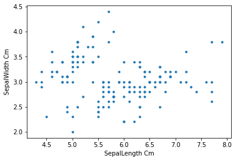
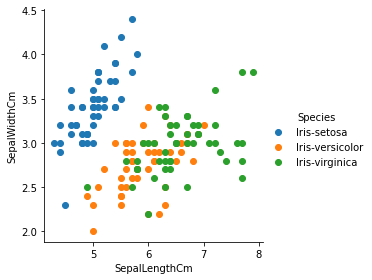
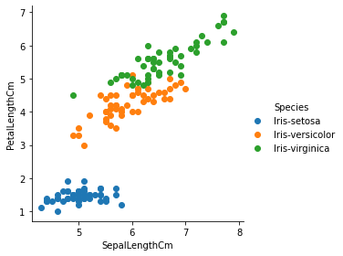
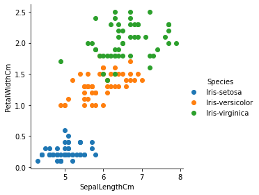
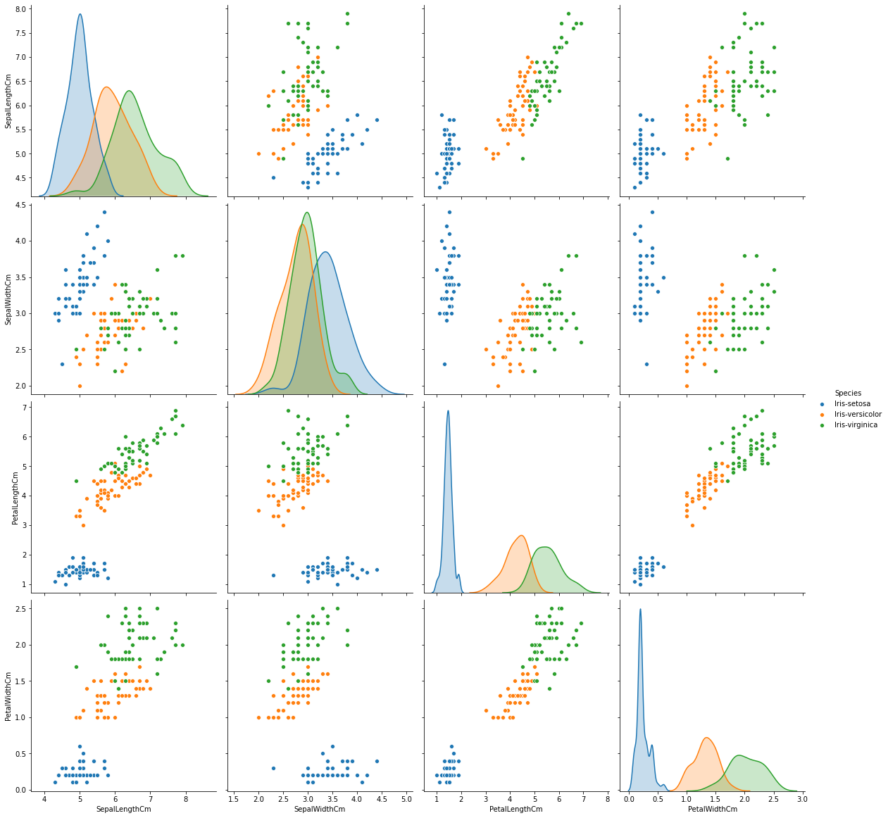
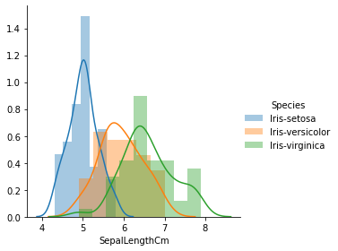
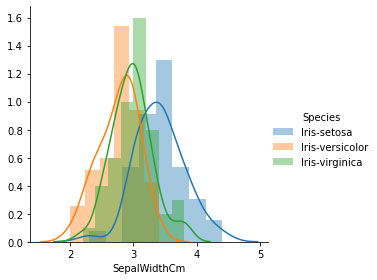
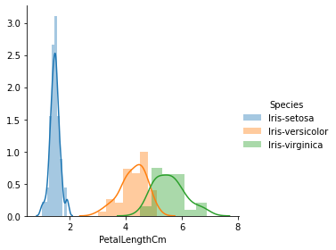
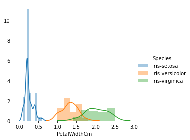

# EDA( Exploratory Data Analysis)
* All about the datasets
* colums /features/ index,independent variable
* target variable /dependent variable


# All figure in 2D


```python
# lib's
import numpy as np
import matplotlib.pyplot as plt
import pandas as pd
```


```python
# Dataframes 
iris = pd.read_csv('Datasets/Iris.csv')

iris
```


<div>
<style scoped>
    .dataframe tbody tr th:only-of-type {
        vertical-align: middle;
    }

    .dataframe tbody tr th {
        vertical-align: top;
    }

    .dataframe thead th {
        text-align: right;
    }
</style>
<table border="1" class="dataframe">
  <thead>
    <tr style="text-align: right;">
      <th></th>
      <th>Id</th>
      <th>SepalLengthCm</th>
      <th>SepalWidthCm</th>
      <th>PetalLengthCm</th>
      <th>PetalWidthCm</th>
      <th>Species</th>
    </tr>
  </thead>
  <tbody>
    <tr>
      <th>0</th>
      <td>1</td>
      <td>5.1</td>
      <td>3.5</td>
      <td>1.4</td>
      <td>0.2</td>
      <td>Iris-setosa</td>
    </tr>
    <tr>
      <th>1</th>
      <td>2</td>
      <td>4.9</td>
      <td>3.0</td>
      <td>1.4</td>
      <td>0.2</td>
      <td>Iris-setosa</td>
    </tr>
    <tr>
      <th>2</th>
      <td>3</td>
      <td>4.7</td>
      <td>3.2</td>
      <td>1.3</td>
      <td>0.2</td>
      <td>Iris-setosa</td>
    </tr>
    <tr>
      <th>3</th>
      <td>4</td>
      <td>4.6</td>
      <td>3.1</td>
      <td>1.5</td>
      <td>0.2</td>
      <td>Iris-setosa</td>
    </tr>
    <tr>
      <th>4</th>
      <td>5</td>
      <td>5.0</td>
      <td>3.6</td>
      <td>1.4</td>
      <td>0.2</td>
      <td>Iris-setosa</td>
    </tr>
    <tr>
      <th>...</th>
      <td>...</td>
      <td>...</td>
      <td>...</td>
      <td>...</td>
      <td>...</td>
      <td>...</td>
    </tr>
    <tr>
      <th>145</th>
      <td>146</td>
      <td>6.7</td>
      <td>3.0</td>
      <td>5.2</td>
      <td>2.3</td>
      <td>Iris-virginica</td>
    </tr>
    <tr>
      <th>146</th>
      <td>147</td>
      <td>6.3</td>
      <td>2.5</td>
      <td>5.0</td>
      <td>1.9</td>
      <td>Iris-virginica</td>
    </tr>
    <tr>
      <th>147</th>
      <td>148</td>
      <td>6.5</td>
      <td>3.0</td>
      <td>5.2</td>
      <td>2.0</td>
      <td>Iris-virginica</td>
    </tr>
    <tr>
      <th>148</th>
      <td>149</td>
      <td>6.2</td>
      <td>3.4</td>
      <td>5.4</td>
      <td>2.3</td>
      <td>Iris-virginica</td>
    </tr>
    <tr>
      <th>149</th>
      <td>150</td>
      <td>5.9</td>
      <td>3.0</td>
      <td>5.1</td>
      <td>1.8</td>
      <td>Iris-virginica</td>
    </tr>
  </tbody>
</table>
<p>150 rows × 6 columns</p>
</div>


```python
print("shape :",iris.shape)
```

    shape : (150, 6)


```python
# features of iris datasets
features = iris.columns
features
```


    Index(['Id', 'SepalLengthCm', 'SepalWidthCm', 'PetalLengthCm', 'PetalWidthCm',
           'Species'],
          dtype='object')


```python
iris.head()
```


<div>
<style scoped>
    .dataframe tbody tr th:only-of-type {
        vertical-align: middle;
    }

    .dataframe tbody tr th {
        vertical-align: top;
    }

    .dataframe thead th {
        text-align: right;
    }
</style>
<table border="1" class="dataframe">
  <thead>
    <tr style="text-align: right;">
      <th></th>
      <th>Id</th>
      <th>SepalLengthCm</th>
      <th>SepalWidthCm</th>
      <th>PetalLengthCm</th>
      <th>PetalWidthCm</th>
      <th>Species</th>
    </tr>
  </thead>
  <tbody>
    <tr>
      <th>0</th>
      <td>1</td>
      <td>5.1</td>
      <td>3.5</td>
      <td>1.4</td>
      <td>0.2</td>
      <td>Iris-setosa</td>
    </tr>
    <tr>
      <th>1</th>
      <td>2</td>
      <td>4.9</td>
      <td>3.0</td>
      <td>1.4</td>
      <td>0.2</td>
      <td>Iris-setosa</td>
    </tr>
    <tr>
      <th>2</th>
      <td>3</td>
      <td>4.7</td>
      <td>3.2</td>
      <td>1.3</td>
      <td>0.2</td>
      <td>Iris-setosa</td>
    </tr>
    <tr>
      <th>3</th>
      <td>4</td>
      <td>4.6</td>
      <td>3.1</td>
      <td>1.5</td>
      <td>0.2</td>
      <td>Iris-setosa</td>
    </tr>
    <tr>
      <th>4</th>
      <td>5</td>
      <td>5.0</td>
      <td>3.6</td>
      <td>1.4</td>
      <td>0.2</td>
      <td>Iris-setosa</td>
    </tr>
  </tbody>
</table>
</div>


```python
# check the value of the target variable
iris['Species'].value_counts()
```


    Iris-versicolor    50
    Iris-setosa        50
    Iris-virginica     50
    Name: Species, dtype: int64


```python
# visualization in 2D
# this is 2D plot what about 3D ,4D,5D plots

plt.scatter(iris['SepalLengthCm'],iris['SepalWidthCm'],marker='.')
plt.xlabel('SepalLength Cm')
plt.ylabel('SepalWidth Cm')
plt.show()
```


    

    


```python
# 3D plot using Seaborn lib 
import seaborn as sns
# observation 
# * we can differentciate by sepal lenght and width just look like the linear separable
g = sns.FacetGrid(iris,hue='Species',height=4)
g.map(plt.scatter,'SepalLengthCm','SepalWidthCm',).add_legend()
plt.show()
```


    

    


```python
g = sns.FacetGrid(iris,hue='Species',height=4)
g.map(plt.scatter,'SepalLengthCm','PetalLengthCm',).add_legend()
plt.show()
```


    

    


```python
g = sns.FacetGrid(iris,hue='Species',height=4)
g.map(plt.scatter,'SepalLengthCm','PetalWidthCm',).add_legend()
plt.show()
```


    

    


# In 3D plots

In Pairplot did very great job but what happen when we have large number of the features
then as humen that make us tired and become un-undertandable form of the data 
but in the that problem we have different tools to solve this problem like Dimesionality reduction techniques


```python
sns.pairplot(iris.drop(columns=['Id']),hue='Species', height=4)
```


    <seaborn.axisgrid.PairGrid at 0x7ff694526c10>


    

    


# Univariate Analysis

univariate Analysis work on the PDF and give us idea how to distribution of the function in
the form of histogram
**observation**
* petal lenght can do more work in order to selecting the model and classifying the problems


```python
g = sns.FacetGrid(iris,hue='Species',height=4)
g.map(sns.distplot ,'SepalLengthCm').add_legend()
plt.show();
# you can see below petal lenght is very mxture with other features


g = sns.FacetGrid(iris,hue='Species',height=4)
g.map(sns.distplot ,'SepalWidthCm').add_legend()
plt.show()
# alos mixture distribution


g = sns.FacetGrid(iris,hue='Species',height=4)
g.map(sns.distplot ,'PetalLengthCm').add_legend()
plt.show()

# but her petal lenght is clear saturated with 
# other features but versicolor and virgnica still mixed with each other


g = sns.FacetGrid(iris,hue='Species',height=4)
g.map(sns.distplot ,'PetalWidthCm').add_legend()
plt.show();


```


    

    


    

    


    

    


    

    


```python

```


```python

```


```python

```


```python

```


```python

```
